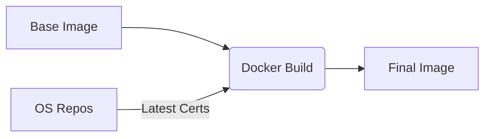

# Design: CA Certificate Freshness

## Architecture

The system relies on "just-in-time" updates during the container build process. Instead of treating the base image as an immutable golden source for OS packages, we treat it as a starting point.

### Component Interaction

1.  **Docker Build:** Initiated by CI (GitHub Actions) or developer (`make build`).
2.  **Base Image:** Pulled from registry (pinned digest).
3.  **Package Manager (apk/microdnf):** Connects to upstream OS repositories (Chainguard/Red Hat).
4.  **Runtime Layer:** The `RUN` instruction fetches and installs the latest `ca-certificates` metadata.
5.  **Final Image:** Contains the base image *plus* the delta of the certificate update.

## Trade-offs

*   **Reproducibility vs. Security:**
    *   *Strict Reproducibility:* Would require pinning the `ca-certificates` version or using a locked snapshot.
    *   *Maximum Security:* (Chosen approach) Always pull the latest. This means a rebuild of the same commit might produce a slightly different image if a new cert bundle was released in the interim. We prioritize having the latest trust store over byte-for-byte reproducibility of the OS layer for this specific component.
*   **Build Time:** Adds a few seconds to the build for the network call and package installation. Deemed negligible.
*   **Distroless Limitation:** We accept the risk that Distroless images might be up to 24 hours stale (Dependabot frequency) regarding CA updates, as we cannot forcefully update them.

## Data Flow

